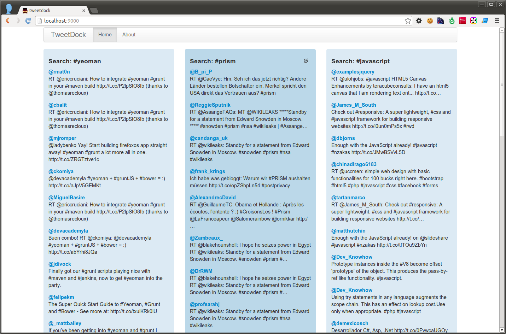

# flight-tweetdock

> Toying around with [Flight](http://twitter.github.io/flight/) to build
> something similar to [TweetDeck](http://tweetdeck.com/).

There isn't anything to see, yet. This will need some sort of back-end to
realize the search with the Twitter API v1.1. Anyway, if you want to snoop
around, you can set it up with:

```bash
npm install & bower install
grunt server
```

Oh, and unfortunately MDV/Polymer isn't installable via bower yet, because it
has recursive dependencies (submodules and stuff). So, you need to manually
clone it:

```
git clone --recursive https://github.com/Polymer/mdv app/bower_components/mdv
```

## Screenshot



## License

MIT
