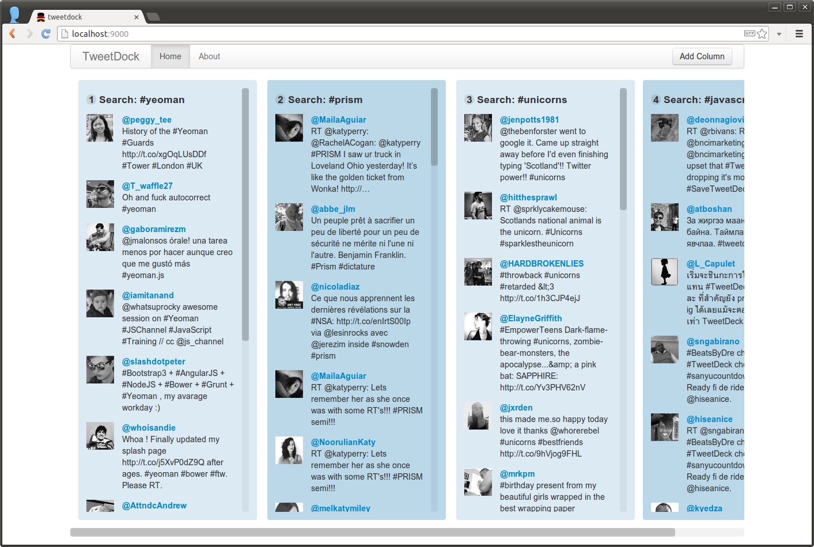

# flight-tweetdock

> Toying around with [Flight](http://twitter.github.io/flight/) to build
> something similar to [TweetDeck](http://tweetdeck.com/).

Since I'm too lazy to build my own backend at the moment, this builds on top of
supertweet.net and you need to create an account there. After that, you need to
add your username and password to `app/js/config.js`. If this doesn't scare you
off, you can set it up with:

```bash
npm install & bower install
grunt server
```

Oh, and unfortunately MDV/Polymer isn't installable via bower yet, because it
has recursive dependencies (submodules and stuff). So, you need to manually
clone it:

```
git clone --recursive https://github.com/Polymer/mdv app/bower_components/mdv
```

There also is a `setup.sh` that automates those three steps.

## Screenshots




## License

MIT
